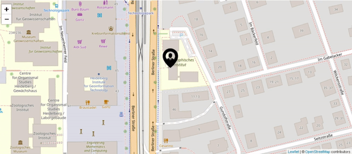

# leaflet-drift-marker

[](http://opensource.org/licenses/MIT)
[](https://www.npmjs.com/package/leaflet-drift-marker)


Support        | Tested |       |     
-------------- | ------ |-------| 
`leaflet`      | 1.5.1  |&#9745;|
`react-leaflet`| 2.4.0  |&#9745;|
* will be tested in lower versions



A plugin for leaflet and react-leaflet, that allows a marker to move smoothly instead of jump to a new position. Reworked to typescript from [Leaflet.Marker.SlideTo!](https://gitlab.com/IvanSanchez/Leaflet.Marker.SlideTo)


## Installation

### Install via NPM

```bash
npm install --save leaflet-drift-marker
```

`leaflet-drift-marker` requires `leaflet` and `react-leaflet` as [`peerDependency`](https://docs.npmjs.com/files/package.json#peerdependencies)

```bash
npm install --save leaflet react-leaflet
```


## Usage

### Leaflet

[](https://codesandbox.io/s/static-bcdhq?fontsize=14)

You can get the build file Drift_marker.js from releases or :  

```html
<script><!-- will be fixed on next release -->
    <!-- Include this script if exports does not exists on window or -->
    <!-- the following error "ReferenceError: exports is not defined" -->
    <!-- before the cdn import -->
        var exports = {};
</script>
<script src='https://unpkg.com/leaflet-drift-marker@1.0.3/lib/DriftMarker/Drift_Marker.js'></script>
```

Still supports all existing leaflet marker properties [check marker](https://leafletjs.com/reference-1.5.0.html#marker)

This plugin implements two new methods:  
* `.slideTo(latlng, slideOptions)` 
    * `latlng` : LeafletLatLng , required  
    * `slideOptions` : Object , required  
        * `duration` : number , required
        * `keepAtCenter` : Boolean , optional 
* `.slideCancel()` 


#### Drift_Marker (with leaflet) 

```javascript
import { Drift_Marker } from "leaflet-drift-marker"
//var Drift_Marker=require("leaflet-drift-marker").Drift_Marker

const marker = new Drift_Marker([10,10]);

marker.slideTo(	[20, 20], {
	duration: 2000,
	keepAtCenter: true
});

```

### react-leaflet

[](https://codesandbox.io/s/react-leaflet-fm1r3?fontsize=14)

Still supports all existing props from react-leaflet marker [check component](https://react-leaflet.js.org/docs/en/components#marker)

Added Props   | Type     | Default | Description
------------- | -------- | ------- | -------------
`duration`    | `number` | ` `    | Required, duration im miliseconds marker will take to destination point
`keepAtCenter`| `boolean`| `false`    | Makes map view follow marker

DriftMarker Component, is the same as react-leaflet Marker Componet, but DriftMarker on update, instead of doing a `setLatLng` does a `slideTo` new position.  

#### DriftMarker (with react-leaflet) example and with position generator

```javascript
import React from 'react'
import { Map, TileLayer, Popup, Tooltip } from 'react-leaflet';
import { DriftMarker } from "leaflet-drift-marker"

function gen_position() {
    return {
        lat:(Math.random()*360-180).toFixed(8),
        lng:(Math.random()*180-90).toFixed(8):
    }
}
class SampleComp extends Component {
    // initial position
    state={ latlng:gen_position()}

    componentDidMount() {
        setTimeout(() => {// updates position every 5 sec
            this.setState({latlng:gen_position()})
        }, 5000);
    }

    render() {
        return <Map center={[2.935403, 101.448205]} zoom={10}>
        <TileLayer
            attribution='&amp;copy <a href="http://osm.org/copyright">OpenStreetMap</a> contributors'
            url="https://{s}.tile.openstreetmap.org/{z}/{x}/{y}.png"
        />
        <DriftMarker
            // if position changes, marker will drift its way to new position
            position={this.state.latlng}
            // time in ms that marker will take to reach its destination
            duration={1000}
            icon={iconPerson} >
            <Popup>Hi this is a popup</Popup>
            <Tooltip>Hi here is a tooltip</Tooltip>
        </DriftMarker>
    </Map>
    }
}
```

# License

MIT License
